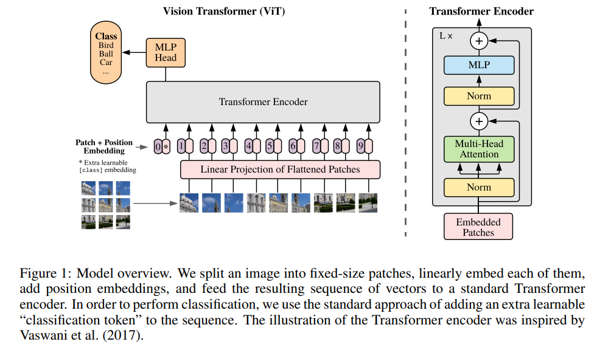
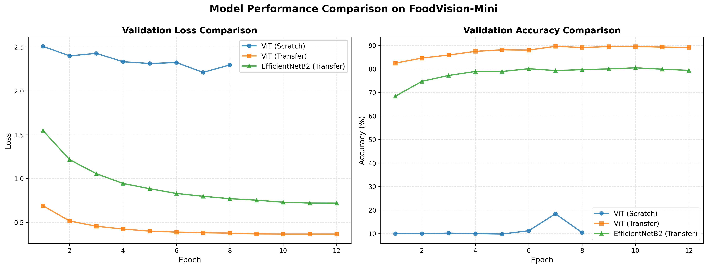
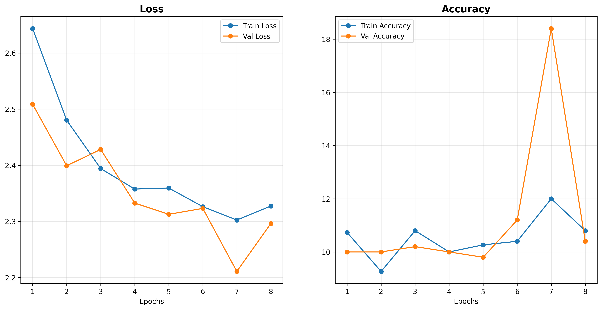
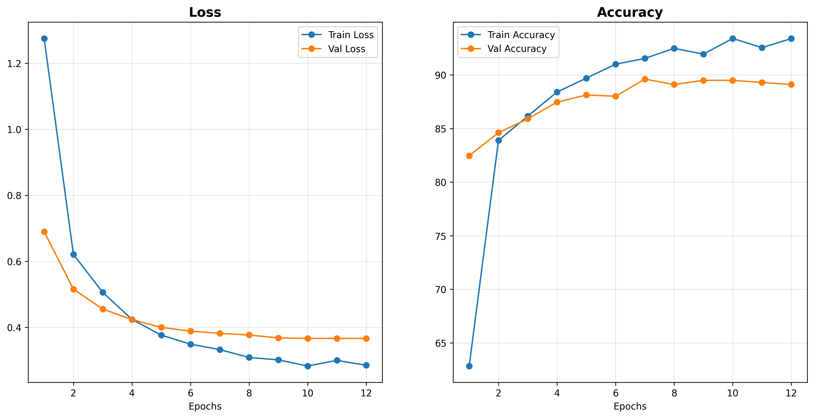
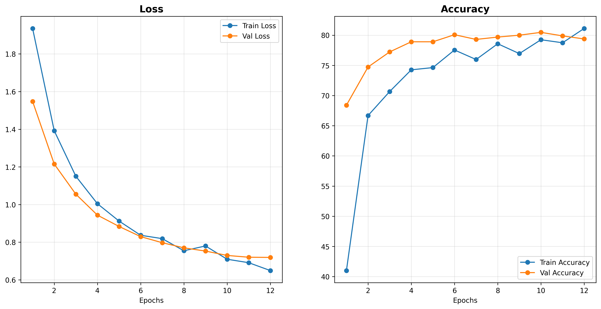

# Replicating Vision Transformer (ViT)

This project focuses on replicating the **Vision Transformer (ViT)** architecture from the original research paper and implementing it from scratch using PyTorch. The objective is to build a clear, practical understanding of transformer-based vision models by reconstructing their core components and evaluating their performance in a realistic training setting.

---

## Reference Paper

The Vision Transformer (ViT) architecture was introduced in:

**“An Image is Worth 16×16 Words: Transformers for Image Recognition at Scale”**  
_Dosovitskiy et al., 2020_

https://arxiv.org/abs/2010.11929

ViT replaces convolutional operations with **global self-attention over image patches**, enabling transformer architectures to perform image classification tasks

---

## Project Goal

The goal of this project is to develop a deep, implementation-level understanding of Vision Transformers by recreating the architecture from scratch in PyTorch.

Because full pretraining of ViT requires extremely large datasets and computational resources, this project instead applies transfer learning and fine-tuning on a smaller, practical dataset. The replicated ViT model is trained and evaluated on the **FoodVision Mini dataset** (10 classes, 150 training images and 50 validation images per class).

To provide a meaningful performance baseline, the fine-tuned ViT model is compared against a convolutional neural network architecture (EfficientNet-B2) trained with the same dataset.

---

## Vision Transformer Architecture Overview

### High-Level Architecture

---

### Transformer Layers and Equations

---

### Model Configuration Used in This Project

| Component                | Value     |
| ------------------------ | --------- |
| Image Size               | 224 × 224 |
| Patch Size               | 16 × 16   |
| Embedding Dimension      | 768       |
| Number of Heads          | 12        |
| Number of Encoder Layers | 12        |
| MLP Hidden Size          | 3072      |
| Number of Classes        | 10        |

_(Values follow the ViT-Base configuration where applicable.)_

---

### Components Implemented From Scratch

The following components were implemented **from scratch** to ensure a deep understanding of the ViT architecture:

- Patch Embedding layer
- Learnable CLS token and positional embeddings
- Transformer Encoder block _(multi-head self-attention, MLP, residual connections)_
- Classification head

**Note:**  
The **Multi-Head Self-Attention (MSA)** operation internally uses the built-in PyTorch attention layer, while the surrounding transformer structure and data flow are implemented manually.

### Results

#### Performance Comparison

| Model                      | Params (M) | Size (MB) | Val Acc (%) | Val Loss | Best Epoch | Training Time (m) |
| -------------------------- | ---------- | --------- | ----------- | -------- | ---------- | ----------------- |
| ViT (Scratch)              | 85.81      | 327.33    | 18.40       | 2.2108   | 7          | 12                |
| ViT (Transfer)             | 85.81      | 327.33    | 89.49       | 0.3665   | 10         | 8                 |
| EfficientNet-B2 (Transfer) | 7.72       | 29.69     | 79.38       | 0.7192   | 12         | 2                 |

_Note: Metrics reported from the epoch with lowest validation loss_

#### Key Findings

- **Small data limitation**: Training ViT from scratch fails on small datasets (only 18.40%)
- **Transfer learning is essential**: ViT accuracy improved from 18.40% → 89.49% using pretrained weights
- **ViT outperforms EfficientNet-B2**: 89.49% vs 79.38% validation accuracy
- **Training efficiency**: EfficientNet-B2 trains faster (2 min) but achieves lower accuracy
- **Model Size**: ViT is significantly larger (x11) than efficientNetB2

<b>Individual Training Curves</b>

### ViT (Scratch)

### ViT (Transfer Learning)

### EfficientNet-B2 (Transfer Learning)

